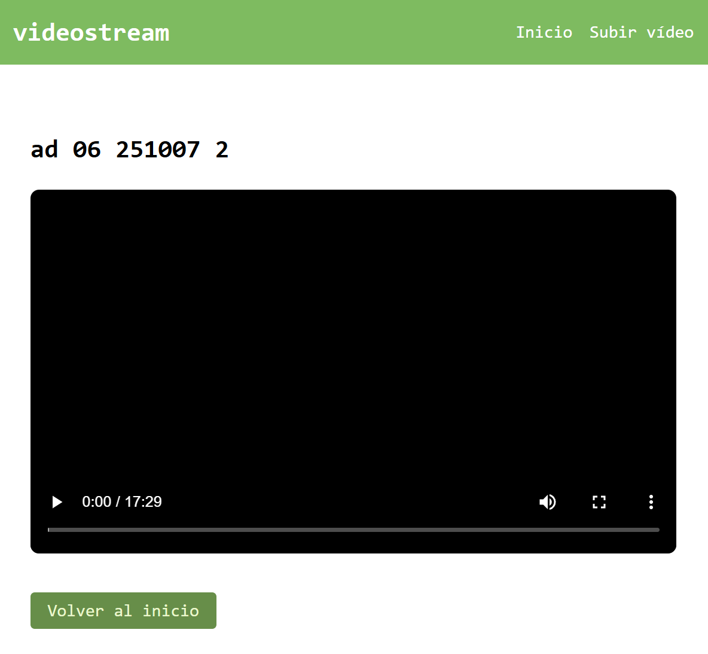

# videostream

una app web para ver y subir vídeos por streaming

los vídeos son almacenados en un bucket en supabase, y para el frontend se usan plantillas jinja2

# preview

## stack y deps

-   python
-   fastapi (servidor web y rutas)
-   uvicorn (asgi server para desarrollo)
-   supabase (almacenamiento de vídeos)
-   jinja2 (renderizado de plantillas html) / css
-   httpx (cliente http async para hacer streaming desde la url pública de supabase)
-   python-dotenv (cargar variables de entorno)
